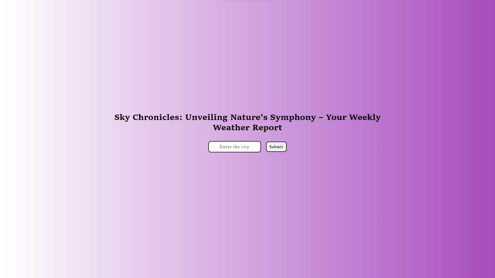
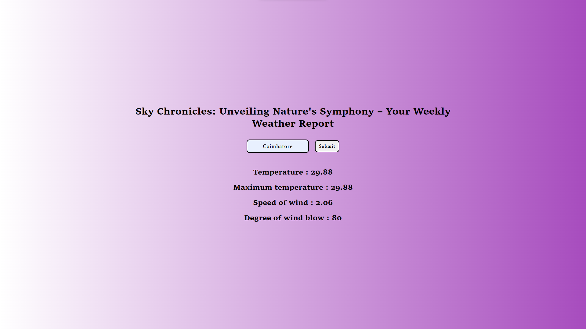

#In our project, we seamlessly integrate the OpenWeather API to fetch real-time weather data for the city. Through the harmonious collaboration of HTML, CSS, and JavaScript, we elegantly present this information to provide users with an immersive and up-to-date weather experience.

